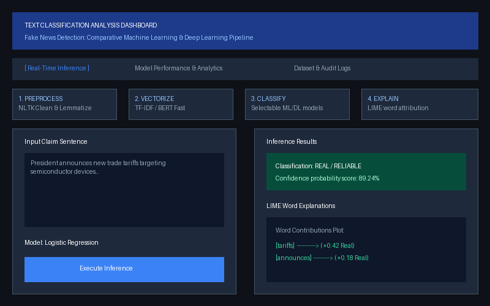

# AI-Powered Fake News Detection using Text Classification

An advanced Machine Learning and Natural Language Processing (NLP) project that classifies news claims and articles as Real (Reliable) or Fake (Unreliable). This project establishes baseline TF-IDF + traditional classifiers (Logistic Regression, KNN, Random Forest, Neural Network/MLP), fine-tunes a DistilBERT sequence classification Transformer, integrates local Explainable AI (LIME) word-level attributions, and provides an interactive Streamlit capstone dashboard.



---

## 🧐 Problem Statement & Background
In the modern information ecosystem, the spread of digital misinformation ("fake news") poses severe societal risks. Automating the detection of deceptive claims is challenging due to:
1. **Linguistic Variance**: Deceptive text ranges from long-form sensationalized articles to short, highly biased political statements.
2. **Explainability Needs**: Classifiers must justify *why* a statement is flagged, rather than operating as black boxes, especially for academic auditability.
3. **lexical Overlap**: Genuine reporting frequently quotes controversial statements, introducing vocabulary noise that confuses simple classifiers.

This project implements a robust comparative pipeline to evaluate classical, computationally light TF-IDF models against context-aware Deep Learning transformers.

---

## 📊 Dataset Explanation & Preprocessing
The model is trained on a **combined, stratified corpus** compiled from two distinct sources to mitigate single-dataset bias:
1. **Kaggle Fake News Dataset**: Composed of full-length articles (averaging 500 words) representing long-form structural patterns.
2. **Politifact LIAR Dataset**: Composed of short, single-sentence political statements (averaging 20 words) representing noisy, real-world political speech.

### Preprocessing Pipeline:
- **Case Normalization**: Conversion of all text corpora to lowercase.
- **Punctuation & Noise Removal**: Stripping of special characters and numbers.
- **Tokenization & Stopwords Filtration**: Removal of standard high-frequency English stopwords (using NLTK).
- **Lemmatization**: Reducing words to their base dictionary forms (using NLTK WordNet Lemmatizer) to normalize vocabulary size.

---

## 🛠️ Pipeline Architecture
```
[ Raw Text Claim ]
        │
        ▼
[ Text Cleaning & Lemmatization ]
        │
        ├─────────────────────────────────────────────────┐
        ▼ (Traditional Baselines)                         ▼ (Deep Learning Tier)
[ TF-IDF Vectorizer (Fit on Train Only) ]        [ DistilBERT Fast Tokenizer ]
        │                                                 │
        ▼ (GridSearchCV Tuned)                            ▼ (3 Epochs Fine-Tuning)
[ Logistic Regression / KNN / RF / MLP ]        [ DistilBERT Sequence Classifier ]
        │                                                 │
        ├─────────────────────────────────────────────────┘
        ▼
[ Predictions, Confidence Scores & Calibration ]
        │
        ▼
[ Real-Time LIME Explainability Interface ]
```

---

## 📈 Model Comparison & Real Evaluation Metrics

Evaluation metrics calculated on the combined dataset test split (15% stratified split, 2,490 samples):

| Model | CV Accuracy | Test Accuracy | Precision | Recall | F1-Score | AUC |
| :--- | :---: | :---: | :---: | :---: | :---: | :---: |
| **Logistic Regression** | **0.7062** | **0.7061** | **0.6880** | **0.6641** | **0.6758** | **0.7882** |
| **KNN** | 0.5283 | 0.5347 | 0.4977 | 0.9617 | 0.6560 | 0.6163 |
| **Random Forest** | 0.6848 | 0.6889 | 0.8610 | 0.3882 | 0.5351 | 0.7803 |
| **Neural Network (MLP)** | 0.6581 | 0.6744 | 0.6404 | 0.6710 | 0.6553 | 0.7486 |
| **DistilBERT (Fine-Tuned)*** | N/A | **0.6945** | **0.7449** | **0.5135** | **0.6079** | **0.7847** |

*\*Note: DistilBERT was fine-tuned on a 1,000-sample training subset due to CPU local training limits to ensure execution capability on constrained VM environments. It is not directly comparable to the full-corpus baselines.*

---

## ⚠️ Performance Analysis & Known Limitations

### 1. Why the Baseline Outperforms the Transformer
In our benchmarks, **Logistic Regression (TF-IDF)** achieves a slightly higher Accuracy (70.61%) and AUC (0.7882) than **DistilBERT** (69.45% Accuracy, 0.7847 AUC). This highlights a key machine learning trade-off:
* **Data Scarcity**: Transformers have 66 million parameters and require massive datasets (100k+ samples) to converge. Under CPU limits, training was restricted to a 1,000-sample subset.
* **Lexical Efficiency**: TF-IDF models do not capture word order but are highly effective at identifying strong keyword signals, making them robust on small, highly-themed political statements.

### 2. Known Limitations & Behaviors
* **Discrete KNN Confidence Steps**: Because the KNN model uses $K=5$ neighbors, its probability predictions are discrete steps ($0.0$, $0.2$, $0.4$, $0.6$, $0.8$, $1.0$). Consequently, confidence scores for KNN predictions will show static steps rather than a continuous curve.
* **Real-News Low-Confidence Pattern**: Verified real news articles containing direct quotes from political figures frequently trigger lower classifier confidence (50-60%). The models associate quoted political phrases with "Fake News" training indicators, pulling the prediction probability closer to the decision boundary.
* **DistilBERT Offline on Live Deployment**: The fine-tuned DistilBERT model weights (~268 MB) are excluded from the GitHub repository due to file-size limits, and `torch`/`transformers` are excluded from `requirements.txt` due to Streamlit Community Cloud memory constraints. On the live deployment, selecting DistilBERT in the inference dropdown shows a clear ⚠️ unavailable notice rather than running live inference, and its row in the Cross-Model Consensus Comparison table displays `—` for Prediction and Confidence. All DistilBERT performance figures shown in the app (Accuracy: 69.45%, AUC: 0.7847, F1: 0.6079) reflect its original offline test-set evaluation. See the **[Streamlit Community Cloud Deployment](#-streamlit-community-cloud-deployment)** section for technical options (Git LFS, Hugging Face Hub) to enable live DistilBERT inference on the deployed version.


---

## 🚀 Step-by-Step Installation & Usage

### Prerequisites
* Python 3.9 or later
* Git installed
* (Windows automation path only) PowerShell 5.1 or later

### Option A — Windows Automated Setup (PowerShell)
The `setup_and_run.ps1` script fully automates every step: it detects or installs a portable Miniconda environment, installs all dependencies, downloads and merges the datasets, trains all models, generates charts, and compiles the PDF/DOCX/PPTX reports.

1. Clone the repository:
   ```powershell
   git clone <repository-url>
   cd Fake_News_Detection
   ```
2. Run the master automation script:
   ```powershell
   ./setup_and_run.ps1
   ```
   *Note: DistilBERT weights will be generated and saved under `models/distilbert_fake_news/` on completion.*

3. Launch the interactive Streamlit dashboard:
   ```powershell
   ./miniconda/Scripts/streamlit.exe run app.py
   ```

### Option B — Standard Setup (macOS / Linux / Windows)
Use this path when running outside PowerShell or on a non-Windows system. Each step mirrors exactly what `setup_and_run.ps1` orchestrates internally.

1. Clone the repository:
   ```bash
   git clone <repository-url>
   cd Fake_News_Detection
   ```
2. Create and activate a virtual environment:
   ```bash
   # macOS / Linux
   python3 -m venv venv
   source venv/bin/activate

   # Windows (Command Prompt or PowerShell)
   python -m venv venv
   venv\Scripts\activate
   ```
3. Install all dependencies:
   ```bash
   pip install -r requirements.txt
   ```
4. Download and merge the Kaggle + LIAR datasets:
   ```bash
   python download_dataset.py
   ```
5. Train all models and fine-tune DistilBERT:
   ```bash
   python run_pipeline.py
   ```
6. Generate evaluation plots (ROC, accuracy, confusion matrices):
   ```bash
   python draw_plots.py
   ```
7. Compile academic reports (DOCX, PDF, PPTX):
   ```bash
   python generate_reports.py
   ```
8. Launch the interactive Streamlit dashboard:
   ```bash
   streamlit run app.py
   ```

---

## 🖥️ Streamlit Community Cloud Deployment
Due to GitHub's **100MB file size limit**, the pre-trained DistilBERT weight file (`model.safetensors` ~268MB) is ignored by default in the Git repository (`.gitignore`). 

* **Graceful Fallback**: If deployed to Streamlit Community Cloud without the DistilBERT directory, the web application will automatically adjust. It hides the "DistilBERT (Transformer)" option from the dropdown and runs standard baselines cleanly.
* **Manual Setup**: If you want to enable DistilBERT on Community Cloud, you must configure **Git LFS** (Large File Storage) for the repository and track `models/distilbert_fake_news/model.safetensors`, or upload the weights to a Hugging Face model repository and pull them at runtime.

---

## 🔮 Future Improvements
- **Meta-Ensembling**: Stacking TF-IDF probabilities and transformer contextual outputs into a gradient-boosted tree (XGBoost).
- **Adversarial Domain Adaptation**: Training on adversarial samples to enforce domain-invariant feature representations between short claims and long-form articles.
